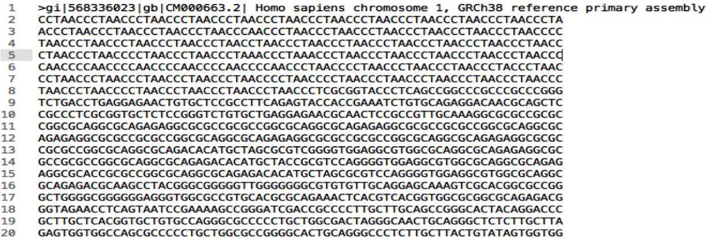
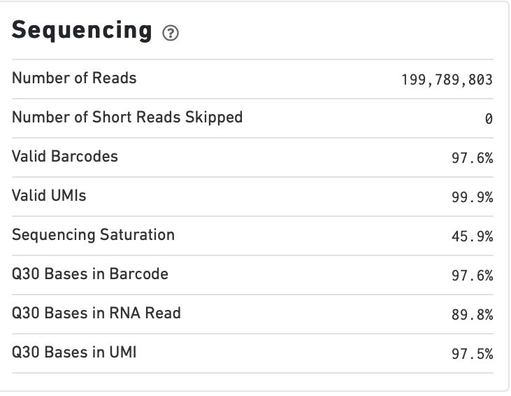

```{r,include=FALSE}
suppressPackageStartupMessages(require(knitr))
knitr::opts_chunk$set(echo = TRUE, tidy = T)
```

## Overview

In this course we are going to introduce basic analysis for single-cell RNAseq, with a specific focus on the *10X system*. The course is divided into multiple sessions. 

In the first session, we will introduce 10x-scRNA, 10x's CellRanger toolkit including how to interpret the **Cell  Ranger QC report** and how to quickly review your data with the **LOUPE Browser**.

## The data

For these sessions we are going to make use of two datasets.

The first set will be from the recent paper [**Enteroendocrine cell lineages that differentially control feeding and gut motility**](https://elifesciences.org/articles/78512).  
This contains scRNA data from either Neurod1 and Neurog3 expressing enteroendocrine cells.

The second dataset is the classic example from PBMC cells.


## Single-cell sequencing

With the advent of advanced microfluidics and refined sequencing technologies, single-cell sequencing has emerged as a technology to profile individual cells from a heterogeneous population without prior knowledge of cell populations.

Pros
- No prior knowledge of cell populations required.
- Simultaneously assess profiles of 1000s of cells.

Cons
- Low sequencing sequencing depth for individual cells (1000s vs millions of reads for bulk). 


## Single-cell use cases

Single-cell sequencing, as with bulk sequencing, has now been applied to the study of a wide range of differing assays.

- **scRNA-seq/snRNA-seq - Transcriptomics**
- scATAC-seq/snATAC-seq - Chromatin accessibility
- CITE-seq - Surface protein expression
- AIRR - TCR/BCR profiling
- Spatial-seq - Spatial profiling of gene expression.


## Single-cell platforms

- **10x Genomics (microfluidics)**
- Smart-seq3 (microfluidics)
- Drop-seq (microfluidics)
- VASA-seq (FANS)
- inDrop-seq (microfluidics)
- In-house solutions 


Many companies offer single-cell sequencing technologies which may be used with the Illumina sequencer.


## Major Single-cell platforms

Two popular major companies offer the most used technologies.

- **10x Genomics**
- Smart-seq3

Major difference between the two are the sequencing depth and coverage profiles across transcripts.

- 10x is 3' biased so will not provide full length transcript coverage.
- As 10x is sequencing only the 3' of transcripts/genes, less sequencing depth is required per transcript/gene


## The 10x Genomics system


## The 10x Genomics system - Microfluidics


## The 10x Genomics system  - Gel beads


## The 10x Genomics system  - Sequencing primers


## The 10x Genomics system  - Sequencing R1

**Read 1**


## The 10x Genomics system  - Sequencing R2

**Read 2**


## The 10x sequence reads

The sequence reads contain:- 

- Information on cell identity (10x barcode)
- Information on molecule identity (UMI)
- Information on sample identity (Index read)
- Information on the RNA molecule (transcriptome read)


## From Sequences to Processed data

As with standard bulk sequencing data, the next steps are typically to align the data to a reference genome/transcriptome and summarize data to a signal matrix.

- Align reads to transcriptome and summarize signal to genes for RNAseq
- Align reads to genome, call enriched windows/peaks and summarize signal in peaks.


## Processing scRNA-seq/snRNA-seq data.

For the processing of scRNA/snRNA from fastQ to count matrix, there are many options available to us.

**Alignment and counting**
- Cellranger count
- STAR - STARsolo
- Subread cellCounts

**Pseudoalignment and counting**
- Salmon - Alevin
- Kallisto - Bustools


## Droplets to counts


The output of these tools is typically a matrix of the signal attributed to cells and genes (typically read counts).

This matrix is the input for all downstream post-processing, quality control, normalization, batch correction, clustering, dimension reduction and differential expression analysis.

The output matrix is often stored in a compressed format such as:- 
- MEX (Market Exchange Format)
- HDF5 (Hierarchical Data Format)


]


]


## HDF5 format

- Optimized format for big data.
- Contains matrix information alongside column and row information.
- Loom format version of HDF5 most popular.
- Efficient to work with programmatically.


## MEX format

- Plain/Compressed text format
- Contains matrix information in tsv file
- Separate row and column files contain barcode (cell) and feature (gene/transcript) information.


This is an example of a directory produced by Cell Ranger. 


## Cell Ranger

Cell Ranger is the typical approach we use to process 10x data. The default setting are pretty good. This is an intensive program, so we will not be running this locally on your laptops. Instead we run it on remote systems , like the HPC.

If you are working with your own data, the data will often be provided as the Cell Ranger output by the Genomics/Bioinformatics teams, like here at Rockefeller University. 


## Cell Ranger


Cell Ranger is a suite of tools for single cell processing and analysis available from 10X Genomics.

In this session we will demonstrate the use of Cell Ranger **Count** tool to process our generated fastQ and create the required files.
]


]


## Cell Ranger Download


- Cell Ranger is available from the [10x genomics website](https://support.10xgenomics.com/single-cell-gene-expression/software/downloads/latest).

- Also available are pre-baked references for Human and Mouse genomes (GRCh37/38 and GRCm37)

]

]


## Cell Ranger

- Cell Ranger only runs on linux machines (CentOS/RedHat 7.0+ and Ubuntu 14.04+).
- Typically, due to memory requirements, users run Cell Ranger on a remote server and not their own machines.
- To download Cell Ranger and the required reference on remote server, we typically use the wget command [This will all be in temrinal on the server you are using.

Download the software

```{shell, eval=FALSE}
wget -O cellranger-7.2.0.tar.gz "https://cf.10xgenomics.com/releases/cell-exp/cellranger-7.2.0.tar.gz?Expires=1701688001&Key-Pair-Id=APKAI7S6A5RYOXBWRPDA&Signature=Puwpsqsf~wMQz5e~PwTvM2DRQO1XdJ~9zeLCWqX6tVbOx~dnf24hP1bwlmNhybr3SZUQ8C12ywcICMH6Au02wxiCRm1uuTxZ0Uvq8g~s8L8s6XFyhepdi6Qjq8dzXNGoxswg3hModjKWVptTWq-MTHBDZv~yTFB7QAM9lzHHXo6SPWg8Fnx30ngmtGC5tDReVOiJ3DY0hsFvZtG3HaQ-HEbnzEH3lre-0rpWMBlsQu-vZ4RnKE0o3Xv6pQsb6261M19nHcpCsGhDCkFjDDbradx~SNw5rpY-HMxM4SnRuaOOI0rYyDNn7xdTat3eFj7rlgATXRaYx7SYNqDYKSrNWw__"
```

Download reference for Human genome (GRCh38)
```{shell, eval=FALSE}
wget -O https://cf.10xgenomics.com/supp/cell-exp/refdata-gex-GRCh38-2020-A.tar.gz
```


## Cell Ranger set-up

- Having downloaded the software and references, we can then unpack them.

Unpack software and references.

```{shell, eval=FALSE}
tar -xzvf cellranger-7.2.0.tar.gz
tar -xzvf refdata-gex-GRCh38-2020-A.tar.gz
```

- Finally we can add the cellranger directory to our PATH.

```{shell, eval=FALSE}
export PATH=/PATH_TO_CELLRANGER_DIRECTORY/cellranger-7.1.0:$PATH
```


## Running Cell Ranger count

Now we have the downloaded Cell Ranger software and required pre-build reference for Human (GRCh38) we can start the generation of count data from scRNA-seq/snRNA-seq fastQ data.

Typically FastQ files for your scRNA run will have been generated using the **Cell Ranger mkfastq** toolset to produce a directory a FastQ files. 

We can now use CellRanger count command with our reference and fastQ files to generate our count matrix and associated files.

If you are analyzing single nuclei RNA-seq data remember to set the **--include-introns** flag.

```{shell, eval=FALSE}
cellranger count --id=my_run_name \
   --fastqs=PATH_TO_FASTQ_DIRECTORY \
   --transcriptome=/PATH_TO_CELLRANGER_DIRECTORY/refdata-gex-GRCh38-2020-A
```


## Working with custom genomes

If you are working with a genome which is not Human and/or mouse you will need to find another source for your Cell Ranger reference.

- Luckily many references are pre-built by other consortiums.
- We can build our own references using other tools in Cell Ranger.


## Creating your own reference

To create your own references you will need two additional files.

- FASTA file - File containing the full genome sequence for the reference of interest
- GTF file - File containing the gene/transcript models for the reference of interest.


## FASTA file (Genome sequence)

- The reference genome stored as a collection of contigs/chromosomes.
- A contig is a stretch of DNA sequence encoded as A,G,C,T,N.
- Typically comes in FASTA format.
    - ">" line contains information on contig
    - Lines following contain contig sequence

<div align="center">

</div>


## GTF (Gene Transfer Format)

 <div align="center">

</div>

- Used to genome annotation.
- Stores position, feature (exon) and meta-feature (transcript/gene) information.

- **Importantly for Cell Ranger Count, only features labelled as exon (_column 3_) will be considered for counting signal in genes**
- **Many genomes label mitochondrial genes with _CDS_ and not _exon_ so these must be updated**


## Using Cell Ranger mkgtf

Now we have the gene models in the GTF format we can use the **Cell Ranger mkgtf** tools to validate our GTF and remove any unwanted annotation types using the attribute flag.

Below is an example of how 10x generated the GTF for the Human reference.

```{shell, eval=FALSE}
cellranger mkgtf Homo_sapiens.GRCh38.ensembl.gtf \
Homo_sapiens.GRCh38.ensembl.filtered.gtf \
                   --attribute=gene_biotype:protein_coding \
                   --attribute=gene_biotype:lncRNA \
                   --attribute=gene_biotype:antisense \
                   --attribute=gene_biotype:IG_LV_gene \
                   --attribute=gene_biotype:IG_V_gene \
                   --attribute=gene_biotype:IG_V_pseudogene \
                   --attribute=gene_biotype:IG_D_gene \
                   --attribute=gene_biotype:IG_J_gene \
                   --attribute=gene_biotype:IG_J_pseudogene \
                   --attribute=gene_biotype:IG_C_gene \
                   --attribute=gene_biotype:IG_C_pseudogene \
                   --attribute=gene_biotype:TR_V_gene \
                   --attribute=gene_biotype:TR_V_pseudogene \
                   --attribute=gene_biotype:TR_D_gene \
                   --attribute=gene_biotype:TR_J_gene \
                   --attribute=gene_biotype:TR_J_pseudogene \
                   --attribute=gene_biotype:TR_C_gene
```


## Using Cell Ranger mkref

Following filtering of your GTF to the required biotypes, we can use the Cell Ranger mkref tool to finally create our custom reference.

```{shell, eval=FALSE}
cellranger mkref --genome=custom_reference \
--fasta=custom_reference.fa  \
--genes=custom_reference_filtered.gtf
```


```{r, results='asis',include=TRUE,echo=FALSE}
if(params$isSlides == "yes"){
  cat("class: inverse, center, middle

# Cell Ranger -  Output files

<html><div style='float:left'></div><hr color='#EB811B' size=1px width=720px></html> 

---
"    
  )
}else{
  cat("# Cell Ranger - Output files

---
"    
  )
  
}

```


## Cell Ranger - Outputs

Having completed the Cell Ranger count step, the user will have created a folder named as set by the **--id** flag for count command.

Within this folder will be the **outs/** directory containing all the outputs generated from Cell Ranger count.


## Cell Ranger - Count Matrices 

The count matrices to be used for further analysis are stored in both MEX and HDF5 formats within the output directories.

The filtered matrix only contains detected, cell-associated barcodes whereas the raw contains all barcodes (background and cell-associated).

**MEX format**
- filtered_feature_bc_matrix
- raw_feature_bc_matrix

**HDF5 format**
- filtered_feature_bc_matrix.h5
- raw_feature_bc_matrix.h5


## Cell Ranger - BAM files 


The outs directory also contains a BAM file of alignments for all barcodes against the reference _(possorted_genome_bam.bam)_ as well as an associated BAI index file _(possorted_genome_bam.bam.bai)_.

This BAM file is sometimes used in downstream analysis such as scSplit/Velocyto as well as for the generation of signal graphs such as bigWigs.
]

 <div align="center">

</div>
 <div align="center">

</div>
<!--  -->
<!--  -->
]


## Cell Ranger - Metrics and Web Summary

Cell Ranger will also output summaries of useful metrics as a text file _(metrics_summary.csv)_ and as a intuitive web-page.

Metrics include

- Counts/UMIs per cell.
- Number of cells detected.
- Alignment quality.
- Distribution of reads in genomic features.
- Sequencing saturation
- t-sne/UMAP with default clustering.


## QC is essential


There are many potential issues which can arise in scRNA-seq/snRNA-seq data including -

- Empty droplets.
- Low quality cell (dead or dying)
- Ambient RNA contamination.
- Doublet detection
]

 <div align="center">

</div>
]

Assessment of the overall quality of a scRNA-seq/snRNA-seq experiment after Cell Ranger can give our first insght into any issues we might face.


```{r, results='asis',include=TRUE,echo=FALSE}
if(params$isSlides == "yes"){
  cat("class: inverse, center, middle

# Cell Ranger - Web Summary QC

<html><div style='float:left'></div><hr color='#EB811B' size=1px width=720px></html> 

---
"    
  )
}else{
  cat("# Cell Ranger - Web Summary QC

---
"    
  )
  
}

```


## Web Summary overview


The web summary html file contains an interactive report describing the most essential QC for your single cell experiment as well as initial clustering and dimension reduction for your data.

The web summary also contains useful information on the input files and the versions used in this analysis for later reproducibility.
]


]


## Sample panel


The first thing we can review is the **Sample** information panel.

- Sample ID - Sample name (Assigned in **cellranger count**)
- Chemistry - The 10x chemistry used
- Include introns - Whether counting was run to include intron counts (typical for single neuron RNA-seq).
- Reference Path and Transcriptome - References used in analysis
- Pipeline Version - Version of Cell Ranger used.


]


]


## Sequencing panel


The **Sequencing** panel highlights information on the quality of the illumina sequencing.

- Number of reads - Total number of paired reads in library
- Valid barcodes - Number of barcodes matching barcodes in whitelist (known to be kit ~ 1 million).
- Valid UMIs - Total number of UMIs that are not all one base and contain no unknown bases.
- Sequencing saturation - Unique valid barcode/UMI versus all valid barcode/UMI
- Q30 scores - Assessment of sequencing qualities for barcode/umi/index/RNA reads.


]


]


## Sequencing panel

Key Metrics:

	* Q30 Bases in RNA read > 65% (usually > 80%)
		+ Reflect to Sequencing quality
		+ Need to check with sequencing service supplier
	* Sequencing saturation > 40% (usually range 20% ~ 80%)
		+ Reflects the complexity of libraries
		+ shall consider, but not necessarily, re-construct library while it too low 


## Mapping panel


The **Mapping** panel highlights information on the mapping of reads to the reference genome and transcriptome.

- Reads mapped to genome - Total number of reads mapping to the genome
- Reads mapped confidently to genome - Reads mapping uniquely to the genome
- Reads mapped confidently to exonic/Intronic - Reads mapping uniquely to the exons or introns
- Reads mapped confidently to transcriptome - Reads mapping to a unique gene (and consistent with slice junctions).


]


]


## Mapping panel

Key Metrics:

	* Mapped to Genome > 60% (usually range 50% ~ 90%)
		+ Mapping rate to reference genome
		+ Check reference genome version if too low
	* Reads Mapped Confidently to Transcriptome > 30% (usually > 60%)
		+ Reflection of annotation to transcriptome
		+ Check annotation if too low


## Cells panel


The **Cells** panel highlights some of the most important information in the report, the total number of cells captured and the distribution of counts across cells and genes.

- Estimated number of cells - Total number of barcodes associated to at least one cell.
- Fraction reads in cells - Fraction of reads from valid barcode, associated to a cell and mapped to transcriptome. 
- Median reads per cell - Median number of transcriptome reads within cell associated barcodes
- Median genes per cell - - Median number of genes detected (at least 1 count) per cell associated barcodes.


]


]


## Cells panel

Key Metrics:

  * Fraction Reads in Cells > 70% (usually > 85%): 
		+ Reflects the ambient RNA contamination
		+ Consider correcting for ambient RNA if < 90%
	* Median reads per cell > 20,000/cell and estimated number of cells 500 ~ 10,000
		+ May be caused by the failure of cell identification if the values were not in normal range
		+ Need to check knee plot and re-evaluate cell number


## Knee plot


The Cell panel also includes and interactive knee plot.

The knee plot shows:- 

- On the x-axis, the barcodes ordered by the most frequent on the left to the least frequent on the right

- On the y-axis, the frequency of each ordered barcode.

- Highlighted in blue are the barcodes marked as associated to cells.


]


]


## Knee plot


It is apparent that barcodes labelled blue (cell-associated barcodes) do not have a cut-off based on UMI count.

In the latest version of Cell Ranger a two step process is used to define cell-associated barcodes based on the EmptyDrops method (Lun et al.,2019).

- First high RNA containing cells are identified based on a UMI cut-off.
- Second, low UMI containing cells are used as a background training set to identify additonal cell-associated barcodes not called in first step.

If required, a **--force-cells** flag can be used with _cellranger count_ to identify a set number of cell-associated barcodes.


]


]


## Knee plot


The Knee plot also acts a good QC tools to investigate differing types of single cell failure.

Whereas our previous knee plot represented a good sample, differing knee plot patterns can be indicative of specific problems with the single cell protocol.

In this example we see no specific cliff and knee suggesting a failure in the integration of oil, beads and samples (wetting failure) or a compromised sample.


]


]


## Knee plot


If there is a clog in the machine we may see a knee plot where the overall number of samples is low.


]


]


## Knee plot


There may be occasions where we see two sets of cliff-and-knees in our knee plot.

This could be indicative of a heterogenous sample where we have two populations of cells with differing overall RNA levels.

Knee plots should be interpreted in the context of the biology under investigation.


]


]


## Analysis page


The web-summary also contains an analysis page where default dimension reduction, clustering and differential expressions between clusters has been performed.

Additionally the analysis page contains information on sequencing saturation and gene per cell vs reads per cell.

]


]


## t-sne and clustering


The t-sne plot shows the distribution and similarity within your data.

- Review for high and low UMI cells driving t-sne structure and/or clustering.
- Expected separation between and structure across clusters may be observed within the t-sne plot.
- Identify expected clusters based on expression of marker genes

]


]


## Sequence and Gene saturation


The sequence saturation and Median genes per cell plots show these calculations (as show on summary page) over successive downsampling of the data. 

By reviewing the curve of the down sampled metrics we can assess whether we are approaching saturation for either of these metrics.

]


 <div align="center">

</div>
 <div align="center">

</div>
]


## Neurod1 Websummary

We have already generated the CellRanger output for Neurod1 enteroendocrine cells and uploaded this to our space [here](https://rubioinformatics.s3.amazonaws.com/scRNA_graduate/SRR_NeuroD1/outs/web_summary.html).

Lets review the websummary for any of these potential QC problems.


```{r, results='asis',include=TRUE,echo=FALSE}
if(params$isSlides == "yes"){
  cat("class: inverse, center, middle

# Cell Ranger - Loupe Browser

<html><div style='float:left'></div><hr color='#EB811B' size=1px width=720px></html> 

---
"    
  )
}else{
  cat("# Cell Ranger - Loupe Browser

---
"    
  )
  
}

```


## Cell Ranger - Loupe browser and Cloupe files 

Cell Ranger also outputs files for visualisation within its own cloupe browser - _cloupe.cloupe_.

This allows for the visualisation of scRNA-seq/snRNA-seq as a t-sne/umap with the ability to overlay metrics of QC and gene expression onto the cells in real time

Let download loupe files for Neurod1 [here](https://rubioinformatics.s3.amazonaws.com/scRNA_graduate/SRR_NeuroD1/outs/cloupe.cloupe).

 <div align="center">

</div>

